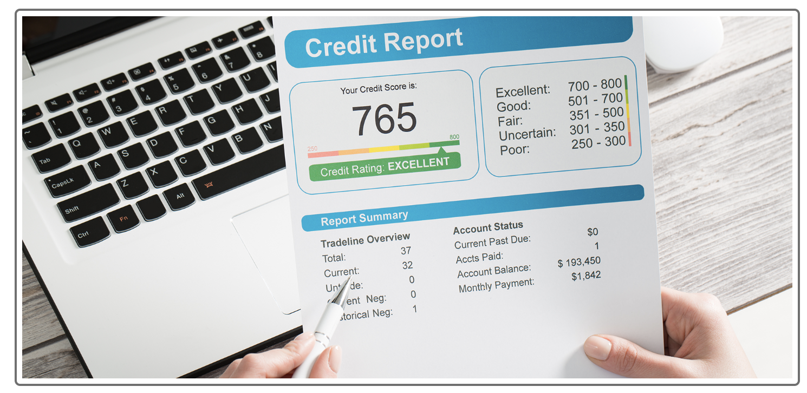

## Credit Risk Classification

Credit risk poses an inherently imbalanced classification problem. Because healthy loans easily outnumber risky loans. We will use various techniques to train and evaluate models with imbalanced classes. We will use a dataset of historical lending activity from a peer-to-peer lending services company to build a model that can identify the creditworthiness of borrowers.

## Project map

This project consists of the following subsections:

First we split the Data into Training and Testing Sets

Second we create a Logistic Regression Model with the Original Data

Third we predict a Logistic Regression Model with Resampled Training Data

Last Credit Risk Analysis Report that contain a summary and an analysis of the performance of both machine learning models that you used in this project.
## results:
- __Machine learning model 1__ (Logistic regression with imbalance )The precision of a healthy loan (0) is 1. That means the health loan predicted by LogisticRegression are all healthy. Recall come out 100% witch mean all healthy loan predicted fine and no inaccurate prediction. The precision for the High-risk loan (1) came out to 0.87, that's mean all the high-risk loan predicted by logistic regression, only 87% was risky, and 13% was healthy loan. The recall of the high risk is 0.91, and 91% of all high-risk data predicted are ok, and 9% of the actual high-risk loans are classified as healthy loans.
- __Machine learning model 2__ (logistic regression that oversample high risk loans before trainnig data )with The precision of a healthy loan (0) is 1. That means the health loan predicted by LogisticRegression are all healthy. Recall come out 100% witch mean all healthy loan predicted fine and no inaccurate prediction. The precision for the High-risk loan (1) came out to 0.87, that's mean all the high-risk loan predicted by logistic regression, only 87% was risky, and 13% was healthy loan. The recall of the high risk is 0.99, and 99% of all high-risk data predicted are ok, and 1% of the actual high-risk loans are classified as healthy loans. And that's the only change we can notice compared to the prediction using the original regression's training.
- __Summary__ We concluded that Random oversampling helped us improve the recall of high-risk loans(1). the only improvement made compared to Model one therefore, we recommend model 2 
## Installation

`conda install -c conda-forge imbalanced-learn`
`conda install -c conda-forge pydotplus`

## Usage

__First__: confirm you have these libraries in file and you successfule run the import

**Import the modules**

*import numpy as np
`import pandas as pd`
- `from pathlib import Path`
- `from sklearn.metrics import balanced_accuracy_score`
- `from sklearn.metrics import confusion_matrix`
- `from imblearn.metrics` 
- `import classification_report_imbalanced`

*import warnings
- `warnings.filterwarnings('ignore')`

__Second__ : click the run botton to review the project results 

## Contriduter

[Karim Bouzina](https://www.linkedin.com/in/karim-bouzina-574348244/)

## Licence:

 © 2023 edX Boot Camps LLC - UW Fintech

